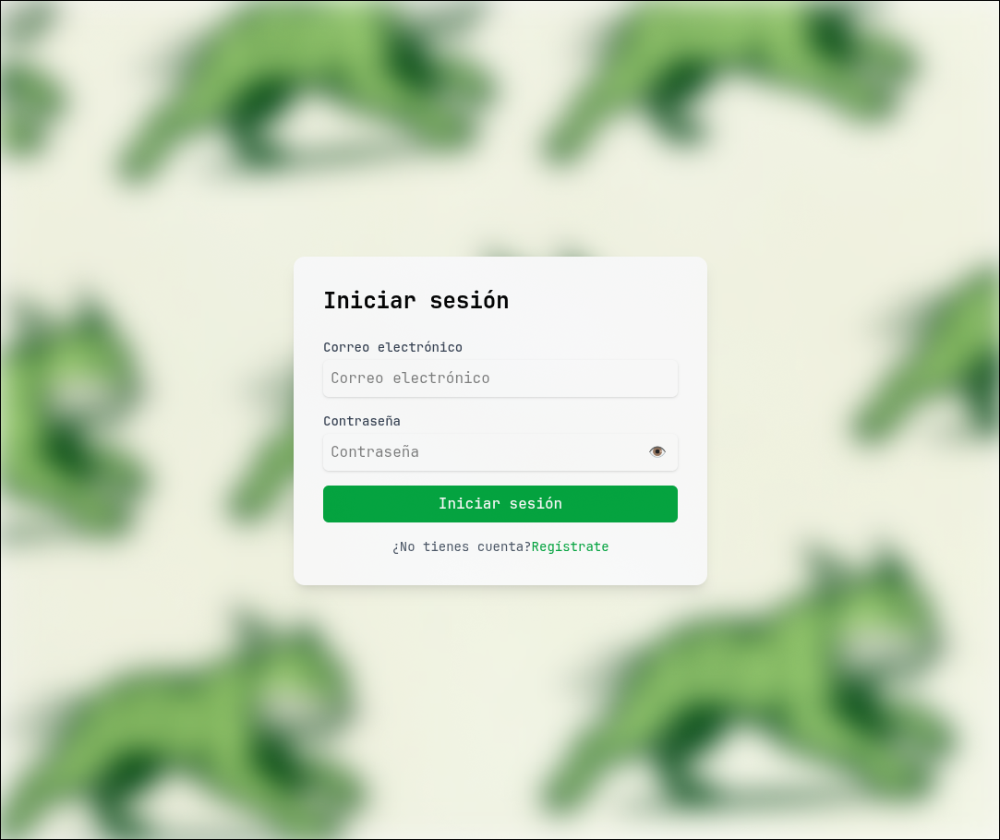
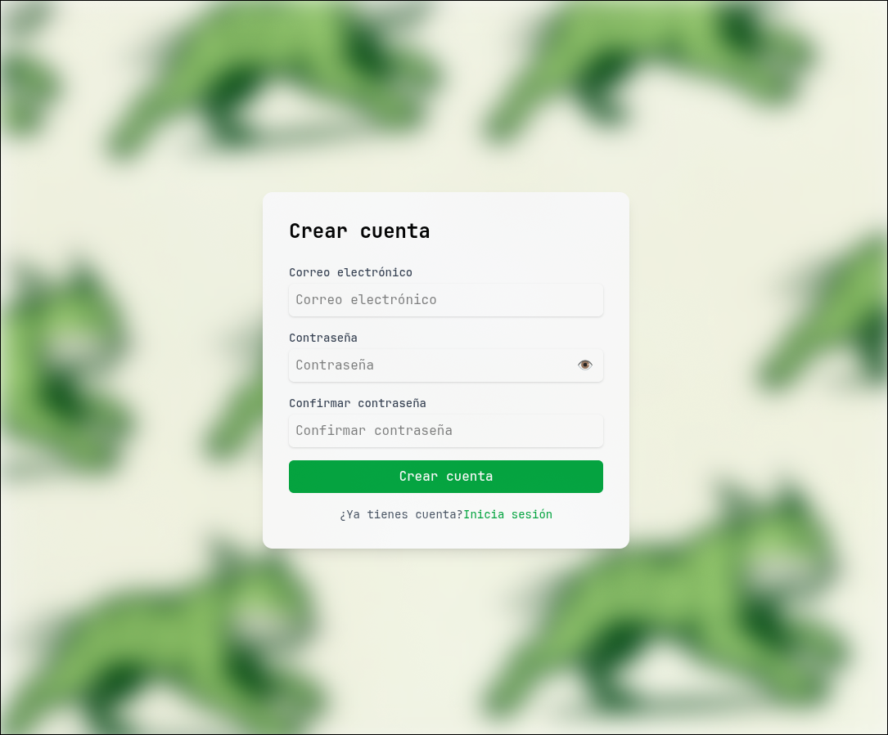

# 👟 RunApp_Front

# 🧠 TechStack

# 📖 Description 

Front for App(RunApp)

# Screenshots

Login Page

 

SignUp Page

 

# 📑 KanBan this proyect 

| 🗒️TO DO | 🔨IN PROGRESS|✅DONE|
| --------------- | --------------- | --------------- |
|📁Init Design core  | ⚙️Add Hook for Form |📦Init the proyect|
|🧾Desing business logic  | |🎨Desing the Login page   |
|🎨Desing the Home page | |🎨Desing the SignUp page   |
|🎨Desing the User page | | |

# Use this repository

## Coming Soon
